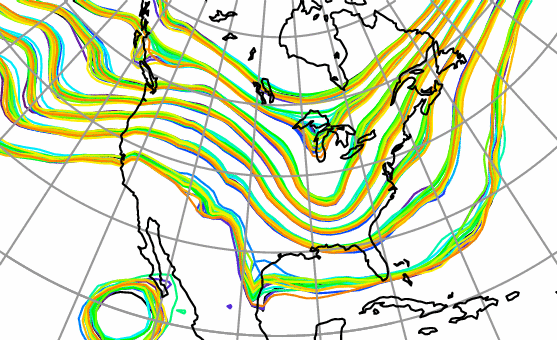
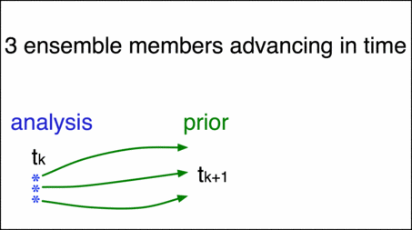

Welcome to the Data Assimilation Research Testbed (DART)
========================================================

Extensive online documentation is available at the GitHub project web pages:
https://dart.ucar.edu/ or in the GitHub `repository <docs/>`__. Quick-start
instructions for the impatient can be found `below <#QuickStart>`__, while more
detailed setup instructions and other topics such as a brief introduction to
data assimilation, the history of DART, etc. are covered in the `DART Getting
Started Guide <https://dart.ucar.edu/pages/Getting_Started.html>`__.

================== ============
|spaghetti_square| |assim_anim|
================== ============

A Matlab-based introduction is in the ``guide/DART_LAB`` directory.
There are a set of PDF presentations along with hands-on Matlab exercises.
This starts with a very basic introduction to data assimilation and covers
several fundamental algorithms in the system.
  
A more exhaustive tutorial for data assimilation with DART is in PDF format at
``theory/readme.rst``.

The DART Manhattan release documentation is on the web:
http://www.image.ucar.edu/DAReS/DART/Manhattan/documentation/html/Manhattan_release.html
and in the repository at:
`guide/html/Manhattan_release.html <guide/html/Manhattan_release.html>`__

There is a mailing list where we summarize updates to the DART repository and
notify users about recent bug fixes. It is not generally used for discussion so
it’s a low-traffic list. To subscribe to the list, click on
`Dart-users <http://mailman.ucar.edu/mailman/listinfo/dart-users>`__. If you use
WRF, there is also a
`Wrfdart-users <http://mailman.ucar.edu/mailman/listinfo/wrfdart-users>`__.

The Manhattan release is new and currently supports only a subset of the models.
We will port over any requested model so contact us if yours is not on the list.
In the meantime, we suggest you check out our ‘classic’ release of DART which is
the Lanai release plus additional development features. All new development will
be based on the Manhattan release but the ‘classic’ release will remain for
those models which already have the necessary features.

DART is developed in collaboration between the staff of the Data Assimilation
Research Section (DAReS) at NCAR and members of the earth science community.

Contact DAReS staff for help and advice by emailing dart@ucar.edu.

Thank you.

DART source code tree
---------------------

The top level DART source code tree contains the following directories and
files:

+------------------------+------------------------------------------------------------+
| Directory              | Purpose                                                    |
+========================+============================================================+
| ``assimilation_code/`` | assimilation tools and programs                            |
+------------------------+------------------------------------------------------------+
| ``build_templates/``   | Configuration files for installation                       |
+------------------------+------------------------------------------------------------+
| ``developer_tests/``   | regression testing                                         |
+------------------------+------------------------------------------------------------+
| ``diagnostics/``       | routines to diagnose assimilation performance              |
+------------------------+------------------------------------------------------------+
| ``guide/``              | General documentation and DART_LAB tutorials              |
+------------------------+------------------------------------------------------------+
| ``models/``            | the interface routines for the models                      |
+------------------------+------------------------------------------------------------+
| ``observations/``      | routines for converting observations and forward operators |
+------------------------+------------------------------------------------------------+
| ``theory/``            | introduction to data assimilation theory                   |
+------------------------+------------------------------------------------------------+
| **Files**              | **Purpose**                                                |
+------------------------+------------------------------------------------------------+
| ``changelog.rst``      | Brief summary of recent changes                            |
+------------------------+------------------------------------------------------------+
| ``copyright.rst``      | terms of use and copyright information                     |
+------------------------+------------------------------------------------------------+
| ``readme.rst``         | Basic Information about DART                               |
+------------------------+------------------------------------------------------------+

Bug reports and feature requests
--------------------------------

Use the GitHub `issue tracker <https://github.com/NCAR/DART/issues>`__ to submit
a bug or request a feature.

Citing DART
-----------

Cite DART using the following text:

   The Data Assimilation Research Testbed (Version X.Y.Z) [Software]. (2019).
   Boulder, Colorado: UCAR/NCAR/CISL/DAReS. http://doi.org/10.5065/D6WQ0202

Update the DART version and year as appropriate.

Quick-start for the impatient
-----------------------------

1. fork the NCAR/DART repo
2. clone your (new) fork to your machine - this will set up a remote named
   ‘origin’
3. create a remote to point back to the NCAR/DART repo … convention dictates
   that this remote should be called ‘upstream’
4. check out the appropriate branch
5. Download one of the tar files (listed below) of ‘large’ files so you can test
   your DART installation.
6. If you want to issue a PR, create a feature branch and push that to your fork
   and issue the PR.

There are several large files that are needed to run some of the tests and
examples but are not included in order to keep the repository as small as
possible. If you are interested in running *bgrid_solo*, *cam-fv*, or testing
the *NCEP/prep_bufr* observation converter, you will need these files. These
files are available at:

+-------------------+------+--------------------------------------------------+
| Release           | Size | Filename                                         |
+===================+======+==================================================+
| “Manhattan”       | 189M | `Manhattan_large_fil                             |
|                   |      | es.tar.gz <https://www.image.ucar.edu/pub/DART/R |
|                   |      | elease_datasets/Manhattan_large_files.tar.gz>`__ |
+-------------------+------+--------------------------------------------------+
| “wrf-chem.r13172” | 141M | `wrf-chem.r13172_large_files.tar                 |
|                   |      | .gz <https://www.image.ucar.edu/pub/DART/Release |
|                   |      | _datasets/wrf-chem.r13172_large_files.tar.gz>`__ |
+-------------------+------+--------------------------------------------------+
| “Lanai”           | 158M | `Lanai_large                                     |
|                   |      | _files.tar.gz <https://www.image.ucar.edu/pub/DA |
|                   |      | RT/Release_datasets/Lanai_large_files.tar.gz>`__ |
+-------------------+------+--------------------------------------------------+
| “Kodiak”          | 158M | `Kodiak_large_                                   |
|                   |      | files.tar.gz <https://www.image.ucar.edu/pub/DAR |
|                   |      | T/Release_datasets/Kodiak_large_files.tar.gz>`__ |
+-------------------+------+--------------------------------------------------+
| “Jamaica”         | 32M  | `Jamaica_large_f                                 |
|                   |      | iles.tar.gz <https://www.image.ucar.edu/pub/DART |
|                   |      | /Release_datasets/Jamaica_large_files.tar.gz>`__ |
+-------------------+------+--------------------------------------------------+
| “Hawaii”          | 32M  | `Hawaii_large_                                   |
|                   |      | files.tar.gz <https://www.image.ucar.edu/pub/DAR |
|                   |      | T/Release_datasets/Hawaii_large_files.tar.gz>`__ |
+-------------------+------+--------------------------------------------------+

Download the appropriate tar file and untar it into your DART repository. Ignore
any warnings about ``tar: Ignoring unknown extended header keyword`` .

Go into the ``build_templates`` directory and copy over the closest
``mkmf.template``._compiler.system\_ file into ``mkmf.template``.

Edit it to set the NETCDF directory location if not in ``/usr/local`` or comment
it out and set $NETCDF in your environment. *This NetCDF library must have been
compiled with the same compiler that you use to compile DART and must include
the F90 interfaces.*

Go into ``models/lorenz_63/work`` and run *quickbuild.csh*.

   | cd models/lorenz_63/work
   | ./quickbuild.csh

If it compiles, *:tada:*! Run this series of commands to do a very basic test:

   | ./perfect_model_obs
   | ./filter

If that runs, *:tada:* again! Finally, if you have Matlab installed on your
system add ‘$DART/diagnostics/matlab’ to your matlab search path and run the
‘plot_total_err’ diagnostic script while in the ``models/lorenz_63/work``
directory. If the output plots and looks reasonable (error level stays around 2
and doesn’t grow unbounded) you’re great! Congrats.

If you are planning to run one of the larger models and want to use the Lorenz
63 model as a test, run ``./quickbuild.csh -mpi``. It will build filter and any
other MPI-capable executables with MPI. *The ‘mpif90’ command you use must have
been built with the same version of the compiler as you are using.*

If any of these steps fail or you don’t know how to do them, go to the DART
project web page listed above for very detailed instructions that should get you
over any bumps in the process.

.. toctree::
   :maxdepth: 1
   :caption: Getting started
   
   /guide/system-requirements
   /guide/fortran-compiler
   /guide/locating-netcdf-library
   /guide/downloading-dart
   /guide/compiling-dart
   /guide/verifying-installation

.. toctree::
   :maxdepth: 1
   :caption: Intermediate topics

.. toctree::
   :maxdepth: 1
   :caption: Models

   /models/LMDZ/README
   /models/ECHAM/README
   /models/null_model/README
   /models/coamps_nest/README
   /models/POP/dart_pop_mod
   /models/POP/README
   /models/pe2lyr/readme
   /models/lorenz_63/README
   /models/9var/README
   /models/gitm/netcdf_to_gitm_blocks
   /models/gitm/gitm_blocks_to_netcdf
   /models/gitm/README
   /models/simple_advection/README
   /models/lorenz_96/README
   /models/ikeda/readme
   /models/coamps/readme
   /models/PBL_1d/README
   /models/ROMS/README
   /models/lorenz_84/README
   /models/mpas_ocn/model_to_dart
   /models/mpas_ocn/readme
   /models/template/readme
   /models/cam-fv/README
   /models/sqg/readme
   /models/rose/README
   /models/mpas_atm/mpas_dart_obs_preprocess
   /models/mpas_atm/README
   /models/forced_lorenz_96/README
   /models/wrf/WRF_DART_utilities/replace_wrf_fields
   /models/wrf/WRF_DART_utilities/wrf_dart_obs_preprocess
   /models/wrf/README
   /models/utilities/default_readme
   /models/cam-old/cam_to_dart
   /models/cam-old/README
   /models/cam-old/dart_to_cam
   /models/cice/README
   /models/am2/README
   /models/cm1/README
   /models/lorenz_04/README
   /models/CESM/doc/setup_guidelines
   /models/CESM/README

.. toctree::
   :maxdepth: 1
   :caption: Latest Release

   /guide/Manhattan_release

.. toctree::
   :maxdepth: 1
   :caption: Prior Releases

   /guide/Lanai_release
   /guide/history/Kodiak_release
   /guide/history/Jamaica_release
   /guide/history/Iceland_release
   /guide/history/hawaii_release
   /guide/history/Guam_release
   /guide/history/Fiji_release

.. toctree::
   :maxdepth: 1
   :caption: History

   /guide/Lanai_diffs_from_Kodiak
   /guide/filter_async_modes
   /guide/DART_LAB/DART_LAB
   /guide/404
   /guide/distributed_state
   /guide/Manhattan_release
   /guide/Manhattan_getting_started
   /guide/rma
   /guide/Manhattan_diffs_from_Lanai
   /guide/forward_operator
   /guide/Lanai_release
   /guide/boilerplate/boilerplate
   /guide/boilerplate/template
   /guide/vertical_conversion
   /guide/history/Iceland_release
   /guide/history/Fiji_release
   /guide/history/pre_j_release
   /guide/history/Kodiak_release
   /guide/history/PostI_diffs_from_I
   /guide/history/Jamaica_release
   /guide/history/Guam_release
   /guide/history/Jamaica_diffs_from_I
   /guide/history/I_diffs_from_workshop
   /guide/history/pre_hawaii_release
   /guide/history/hawaii_release
   /guide/history/pre_guam_release
   /guide/history/Post_Iceland_release
   /guide/bitwise_considerations
   /guide/mpi_intro
   /guide/netcdf_inflation_files
   /guide/state_structure

.. toctree::
   :maxdepth: 1
   :caption: Other

   /build_templates/mkmf
   /copyright
   /theory/index
   /models/bgrid_solo/fms_src/atmos_shared/tracer_driver/atmos_radon
   /models/bgrid_solo/fms_src/atmos_shared/tracer_driver/atmos_sulfur_hex
   /models/bgrid_solo/fms_src/atmos_shared/tracer_driver/atmos_tracer_driver
   /models/bgrid_solo/fms_src/atmos_shared/tracer_driver/atmos_carbon_aerosol
   /models/bgrid_solo/fms_src/atmos_shared/tracer_driver/atmos_tracer_utilities
   /models/bgrid_solo/fms_src/atmos_shared/vert_advection/vert_advection
   /models/bgrid_solo/fms_src/shared/time_manager/time_manager
   /models/bgrid_solo/fms_src/shared/field_manager/field_manager
   /models/bgrid_solo/fms_src/shared/horiz_interp/horiz_interp
   /models/bgrid_solo/fms_src/shared/fms/fms
   /models/bgrid_solo/fms_src/shared/constants/constants
   /models/bgrid_solo/fms_src/shared/platform/platform
   /models/bgrid_solo/fms_src/shared/utilities/utilities
   /models/bgrid_solo/fms_src/shared/tracer_manager/tracer_manager
   /models/bgrid_solo/fms_src/shared/mpp/mpp_domains
   /models/bgrid_solo/fms_src/shared/mpp/mpp_io
   /models/bgrid_solo/fms_src/shared/mpp/mpp
   /models/bgrid_solo/fms_src/shared/fft/fft
   /models/bgrid_solo/fms_src/shared/sat_vapor_pres/sat_vapor_pres
   /models/bgrid_solo/fms_src/shared/topography/topography
   /models/bgrid_solo/fms_src/shared/topography/gaussian_topog
   /models/bgrid_solo/fms_src/shared/diag_manager/diag_manager
   /models/bgrid_solo/fms_src/shared/diag_manager/diag_table_tk
   /models/bgrid_solo/fms_src/atmos_bgrid/tools/bgrid_polar_filter
   /models/bgrid_solo/fms_src/atmos_bgrid/tools/bgrid_halo
   /models/bgrid_solo/fms_src/atmos_bgrid/tools/bgrid_horiz
   /models/bgrid_solo/fms_src/atmos_bgrid/tools/bgrid_cold_start
   /models/bgrid_solo/fms_src/atmos_bgrid/tools/bgrid_prog_var
   /models/bgrid_solo/fms_src/atmos_bgrid/tools/bgrid_diagnostics
   /models/bgrid_solo/fms_src/atmos_bgrid/tools/bgrid_integrals
   /models/bgrid_solo/fms_src/atmos_bgrid/tools/bgrid_change_grid
   /models/bgrid_solo/fms_src/atmos_bgrid/tools/bgrid_masks
   /models/bgrid_solo/fms_src/atmos_bgrid/tools/bgrid_vert
   /models/bgrid_solo/fms_src/atmos_bgrid/driver/solo/atmosphere
   /models/bgrid_solo/fms_src/atmos_bgrid/model/bgrid_core
   /models/bgrid_solo/fms_src/atmos_bgrid/model/bgrid_core_driver
   /models/bgrid_solo/fms_src/atmos_param/hs_forcing/hs_forcing
   /models/bgrid_solo/fms_src/atmos_solo/atmos_model
   /models/bgrid_solo/README
   /models/noah/README
   /models/FESOM/README
   /models/NCOMMAS/dart_to_ncommas
   /models/NCOMMAS/readme
   /models/NCOMMAS/ncommas_to_dart
   /models/wrf_hydro/README
   /models/tiegcm/readme
   /models/lorenz_96_2scale/README
   /models/MITgcm_ocean/trans_pv_sv
   /models/MITgcm_ocean/trans_sv_pv
   /models/MITgcm_ocean/readme
   /models/MITgcm_ocean/create_ocean_obs
   /models/clm/readme
   /assimilation_code/location/channel/location_mod
   /assimilation_code/location/location_mod
   /assimilation_code/location/oned/location_mod
   /assimilation_code/location/threed_cartesian/location_mod
   /assimilation_code/location/threed_sphere/location_mod
   /assimilation_code/programs/obs_seq_verify/obs_seq_verify
   /assimilation_code/programs/wakeup_filter/wakeup_filter
   /assimilation_code/programs/compare_states/compare_states
   /assimilation_code/programs/gen_sampling_err_table/gen_sampling_err_table
   /assimilation_code/programs/perturb_single_instance/perturb_single_instance
   /assimilation_code/programs/system_simulation/system_simulation
   /assimilation_code/programs/compute_error/compute_error
   /assimilation_code/programs/preprocess/preprocess
   /assimilation_code/programs/obs_impact_tool/obs_impact_tool
   /assimilation_code/programs/create_fixed_network_seq/create_fixed_network_seq
   /assimilation_code/programs/obs_loop/obs_loop
   /assimilation_code/programs/perfect_model_obs/perfect_model_obs
   /assimilation_code/programs/obs_selection/obs_selection
   /assimilation_code/programs/obs_sequence_tool/obs_sequence_tool
   /assimilation_code/programs/integrate_model/integrate_model
   /assimilation_code/programs/obs_diag/oned/obs_diag
   /assimilation_code/programs/obs_diag/threed_cartesian/obs_diag
   /assimilation_code/programs/obs_diag/threed_sphere/obs_diag
   /assimilation_code/programs/fill_inflation_restart/fill_inflation_restart
   /assimilation_code/programs/obs_seq_coverage/obs_seq_coverage
   /assimilation_code/programs/advance_time/advance_time
   /assimilation_code/programs/model_mod_check/model_mod_check
   /assimilation_code/programs/closest_member_tool/closest_member_tool
   /assimilation_code/programs/restart_file_tool/restart_file_tool
   /assimilation_code/programs/filter/filter
   /assimilation_code/programs/obs_keep_a_few/obs_keep_a_few
   /assimilation_code/programs/create_obs_sequence/create_obs_sequence
   /assimilation_code/programs/obs_seq_to_netcdf/obs_seq_to_netcdf
   /assimilation_code/programs/obs_common_subset/obs_common_subset
   /assimilation_code/modules/utilities/ensemble_manager_mod
   /assimilation_code/modules/utilities/random_seq_mod
   /assimilation_code/modules/utilities/mpi_utilities_mod
   /assimilation_code/modules/utilities/time_manager_mod
   /assimilation_code/modules/utilities/utilities_mod
   /assimilation_code/modules/utilities/types_mod
   /assimilation_code/modules/utilities/schedule_mod
   /assimilation_code/modules/observations/obs_kind_mod
   /assimilation_code/modules/observations/DEFAULT_obs_kind_mod
   /assimilation_code/modules/observations/obs_sequence_mod
   /assimilation_code/modules/assimilation/smoother_mod
   /assimilation_code/modules/assimilation/assim_readme
   /assimilation_code/modules/assimilation/assim_tools_mod
   /assimilation_code/modules/assimilation/cov_cutoff_mod
   /assimilation_code/modules/assimilation/obs_readme
   /assimilation_code/modules/assimilation/reg_factor_mod
   /assimilation_code/modules/assimilation/adaptive_inflate_mod
   /assimilation_code/modules/assimilation/quality_control_mod
   /assimilation_code/modules/assimilation/filter_mod
   /developer_tests/location/location_mod
   /developer_tests/forward_operators/README
   /developer_tests/utilities/PrecisionCheck
   /observations/forward_operators/obs_def_gps_mod
   /observations/forward_operators/obs_def_dew_point_mod
   /observations/forward_operators/obs_def_ocean_mod
   /observations/forward_operators/obs_def_1d_state_mod
   /observations/forward_operators/obs_def_radar_mod
   /observations/forward_operators/DEFAULT_obs_def_mod
   /observations/forward_operators/obs_def_mod
   /observations/forward_operators/obs_def_rttov_mod
   /observations/obs_converters/SSEC/SSEC
   /observations/obs_converters/GTSPP/GTSPP
   /observations/obs_converters/gps/gps
   /observations/obs_converters/GSI2DART/README
   /observations/obs_converters/WOD/WOD
   /observations/obs_converters/tpw/tpw
   /observations/obs_converters/ROMS/ROMS
   /observations/obs_converters/COSMOS/COSMOS_to_obs
   /observations/obs_converters/COSMOS/COSMOS_development
   /observations/obs_converters/var/littler_tf_dart
   /observations/obs_converters/var/rad_3dvar_to_dart
   /observations/obs_converters/var/var
   /observations/obs_converters/tropical_cyclone/tc_to_obs
   /observations/obs_converters/Ameriflux/level4_to_obs
   /observations/obs_converters/cice/cice_to_obs
   /observations/obs_converters/DWL/dwl_to_obs
   /observations/obs_converters/MIDAS/MIDAS_to_obs
   /observations/obs_converters/SST/SST
   /observations/obs_converters/MODIS/MOD15A2_to_obs
   /observations/obs_converters/MODIS/MODIS_README
   /observations/obs_converters/NCEP/prep_bufr/prep_bufr
   /observations/obs_converters/NCEP/ascii_to_obs/create_real_obs
   /observations/obs_converters/SSUSI/convert_f16_edr_dsk
   /observations/obs_converters/ok_mesonet/ok_mesonet
   /observations/obs_converters/snow/snow_to_obs
   /observations/obs_converters/text/text_to_obs
   /observations/obs_converters/radar/radar
   /observations/obs_converters/MADIS/MADIS
   /observations/obs_converters/quikscat/QuikSCAT
   /observations/obs_converters/AIRS/AIRS
   /observations/obs_converters/AVISO/AVISO
   /readme
   /changelog